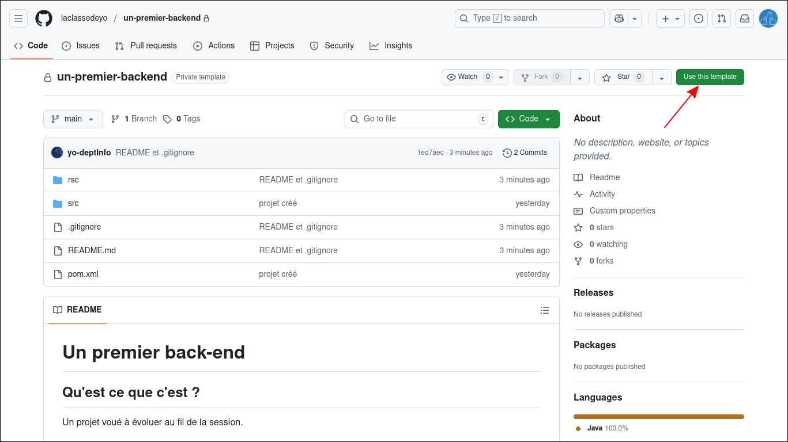
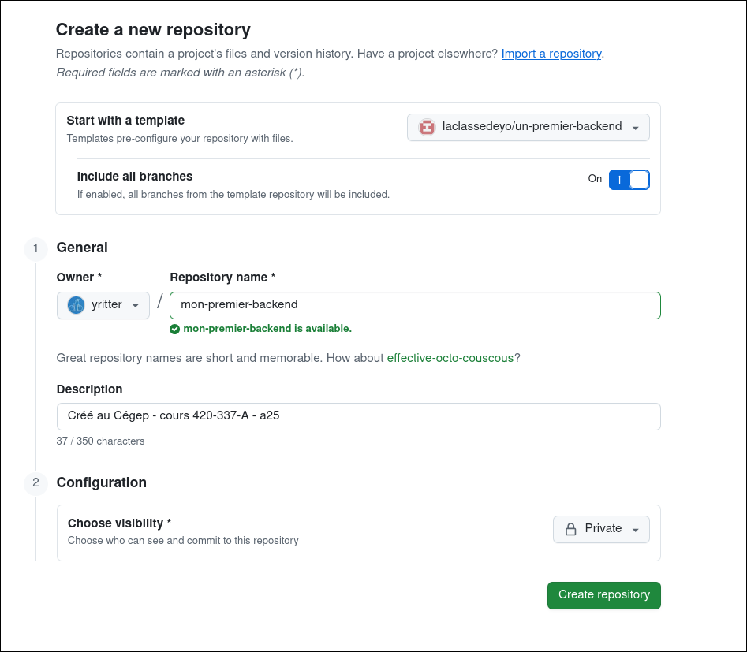

# Un premier back-end

## Qu'est ce que c'est ?

Un projet voué à évoluer au fil de la session.

## Étapes pour créer un fork sur GitHub :

1. **Accéder au projet du prof** :
   - Ouvre ton navigateur et va sur [le dépôt du prof](https://github.com/laclassedeyo/un-premier-backend/).
   - Connecte-toi à ton compte GitHub si ce n'est pas déjà fait.

2. **Créer une divergence** :
   - Une fois sur la page du projet, utilise le bouton **"Use this template"** en haut à droite.
   - Tu vas créer une copie du projet dans ton propre compte GitHub.
      
   

3. **Précisions** :
   Pour le nouveau dépôt, tu peux / dois modifier :
   - (!!!) le propriétaire
   - le nom du projet
   - la description
   - (!!!)la visibilité




4. **Accéder à ta divergence** :
   - Après la création , tu seras redirigé vers la nouvelle copie du projet dans ton compte.
   - Cloner ton dépôt sur ta machine locale
     ```bash
     git clone <URL_DU_DEPOT>
     ```
   - déplace toi à la racine de ton dépot

